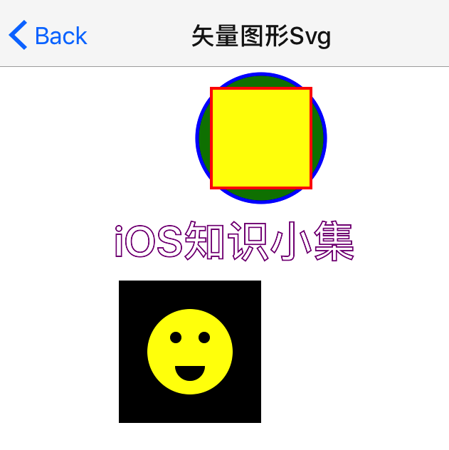

ReactNative从入门到精通(2)-第三方库的管理
--------

**作者**: [mactive](https://weibo.com/mactive)

> 作为系列文章的第二篇文章，本文主要聊一下 `React Native` 的一些命令行辅助工具对 `Native` 项目做了哪些改动。

上一篇文章主要简单介绍了 `iOS` 的开发工具、编译过程，对比了下两个平台的包管理工具。

这里值得一提的是 `React Native` 自身和一些第三方的库都使用了 **`NPM`** 来管理代码，实际上 `Pod` 或者 `Gradle` (Android Build Tool) 都是从 `node_modules` 目录中加载 `Native` 的库。

那么问题来了......

## 引入第三方 React Native 组件时，项目发生了什么变化

或者说 `react-native link` 帮你做了什么。

为什么要引入第三方库呢，那还不是因为第一方没这个功能或者做的不太好呢。`明知故问233`

如果第三方库使用 `Pure.js` 的方式写成，那么对 `Native` 项目没有任何改动。那如果第三方库中有 `native` 代码呢？请往下看。

大家可以先了解一下 `pod install` 帮你做了什么，详情查看 **细聊 Cocoapods 与 Xcode 工程配置** `https://bestswifter.com/cocoapods/`。在这里做个简单的总结：

* 项目结构改变: 主工程由单一的 `.xcodeproj` 变成 `.xcodeproj + pod.xcodeproj` ，同时生成了 `.xcworkspace` 项目；
* 项目依赖改变: 会自动引入第三库依赖的系统动态库，前提是依赖库的 `podspec` 中声明了需要哪些 `frameworks`；
* 主工程不显式的依赖各个第三方库，但是引用了 `libPods-xxx.a` 这个 `Cocoapods` 库；
* 主工程 `.xcodeproj` 尽量不改动；

那么 `react-native link` 又做了什么呢？


它会同时帮你修改 `Android` 项目和 `iOS` 项目。实际上它在调用 `react-native link` 的前身 **rnpm-install** `https://github.com/rnpm/rnpm`（项目主要开发人员也加入了 `RNCoreTeam`）。下面会解释 `react-native link` 做了什么。

### 主要变化有二

1.增加了 `Libraries` 目录。如果你使用 `react-native init` 来初始化程序的话，`React Native` 的主文件也会在 `Libraries` 目录下。但这非常不 `Cocoapods`。下面举例的是已经 `Pod` 化的项目又运行了 `react-native link` 后的效果。


大家可以对比下 `react-native init AwesomeProject` 初始化之后的项目结构。有没有和上面很像？其实它就是通过批量执行 `link`，把 `React Native` 自身的一些 `Project` 统统放到了 `Libraries` 下面。并且帮你加好 `Linked Frameworks and Libraries`。这个原理和 **carthage** `http://swiftcafe.io/2015/10/25/swift-daily-carthage-package` (iOS 上另一个包管理工具) 不太一样。

2.`Build Phases` 中的 `Link Binary with Libraries` 增加了静态库的依赖。这个变动打破了我们使用 `Pod` 来管理项目的优美感，还加个了 `tvOS.a`，搞得我们会为 `AppleTV` 作支持一样，-_-！


这些改动都体现在了主工程 `.xcodeproj` 的改动上, 谁让 `xcodebuild` 就是根据 `.xcodeproj` 文件来进行编译的呢？


为什么要这么做呢？原因如下：`React Native` 官方肯定不会默认你的 `iOS` 项目使用了 `Cocoapods` 了的。他只能这么搞，才保证你的项目能跑起来.

> 不过如果项目使用了 `Cocoapods` 之后可以完全无视`react-native link xxx`的存在。

先通过 `npm` 安装你需要的依赖：

```ruby
npm install react-native-svg --save
```

然后将 `pod` 指向本地 `node_modules` 的目录，在 `pod install` 之后 `主工程.xcodeproj` 没有丝毫改变，甚至 `.xcworkspace` 也没有改变，只是 `Podfile`中增加了下面一行：

```
pod 'RNSVG', :path => '../node_modules/react-native-svg'
```

> 注：几乎所有的第三方 `React Native` 库都支持 `Pod` 的方式引入的。

我使用了 `SVG` 搞了个小 `demo`，下一步会用它做图标字体。效果如下：空心字、绘图等。



## 一个 `react-native init project` 创建的项目如何 pod 化
官方指南 `https://facebook.github.io/react-native/docs/integration-with-existing-apps.html#configuring-cocoapods-dependencies` 里有详细说明，除此之外，可以执行以下操作：

1. `gem install cocoapods`：保证 `pods` 是最新版本；
2. `pod install`：`pod` 第一次初始化的时候会拉取 `500M` 的文件到本地；
3. `pod update`(可选)：也可以手动升级下本地的 `repo`，以防有些新包或者新版本找不到；
4. 删掉原来 `主工程.xcodeproj` 中的 `Libraries` 目录引用。`Linked Frameworks and Libraries`也会自动消失，如下图：


## `react-native link` 是怎么实现的呢?

`react-native link` 会去执行你项目中的 `../node_modules/react-native/local-cli/link/link.js`。这里面不光支持 `iOS` 和 `Android` ，还支持 `WindowsPhone` 呢。


我们再深入 `registerDependencyIOS` 里面看一下。可以发现这里就是怎么分步骤的去修改 `主文件.xcodeproj` 文件：包括 `headerSearchPath`、`addFileToProject`、`addShardLibrary` 等好几部分。是不是很熟悉？还有 **xcode** `https://www.npmjs.com/package/xcode` 这么神奇的库。
感觉用 `JS` 分分钟写个 `cocoapods` 应该也不怎么难了。就像 `PostCss`/`Less` 替代了 `Sass` (ruby写的) 一样。


至此我们印证了 `Xcode IDE` 不过是个可视化编辑 `.xcodeproj` 文件的工具。当然不止于此，不过除了经常死机，有个插件系统之外，没有什么太多的优点。编译的累活还是离不开 `XcodeBuild` 和 `LLVM`。

##  Android 上如何理解

首先 `Gradle` 是一个 `Java` 系语言的自动化构建工具。使用一种基于 `Groovy` 的特定领域语言来声明项目设置，而不是 `XML` 或者 `JSON` 。这个世界里 `ruby` 没有去插手。

`Android` 项目的依赖是使用的 `Maven` (Java的包管理工具。支持多种 `repo` 源，也支持私有部署) 去管理，可以类比 `Cocoapods`。

`Gradle` 可以类比 `Fastlane`。大部分功能重合，例如签名、打包、发布。

## 总结

使用 `Cocoapods/Gradle` 可以更简单的整合 `React Native` 三方组件。进一步降低了 `FE` 同学们学习的难度。而且全程不需要打开 `Xcode`。

`Dive Deep & Enjoy Coding`

