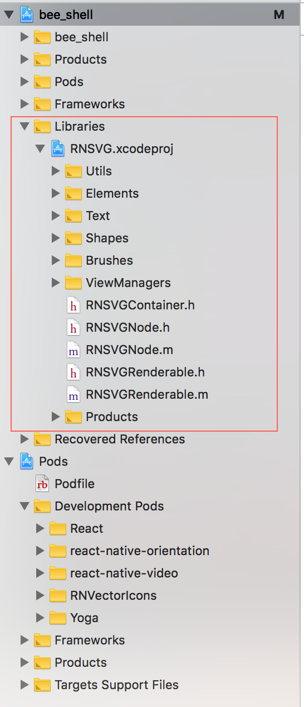
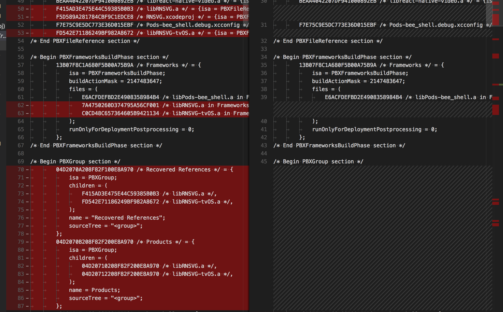
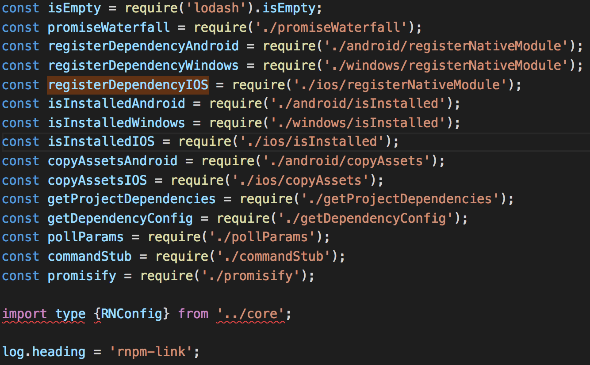
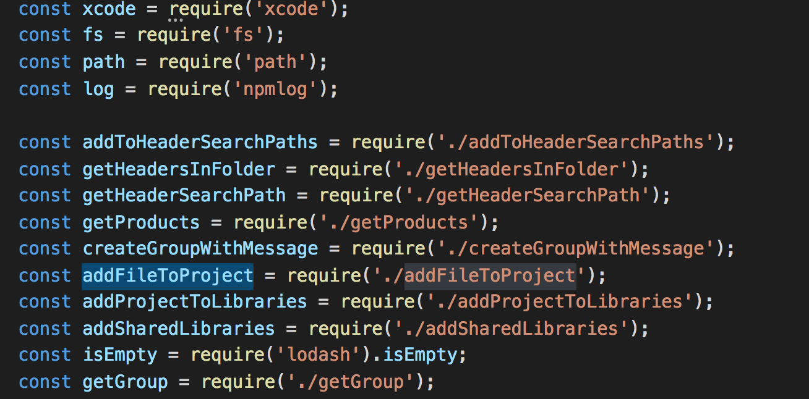

ReactNative从入门到精通(2)-理解iOS开发-FE向
--------

**作者**: [mactive](https://weibo.com/mactive)

作为系列文章的第二篇文章, 主要聊一下RN的一些命令行辅助工具对Native项目做了哪些改动

## 和RN相关的一些Native知识

上一篇文章主要简单介绍了iOS的编译过程, 对比了下两个平台的包管理工具.
这里值得一提的是`React-Native`自身和一些第三方的库都使用了NPM来管理代码, 那么`Pod`或者`Gradle`(Android Build Tool)都从node_modules目录中加载.

那么问题来了

## 引入第三方RN组件时,项目发生了什么变化

或者说 `react-native link` 帮你做了什么.

为什么要引入第三方库呢,那还不是因为第一方没这个功能或者做的不太好呢. `明知故问233`

如果第三方库使用Pure.js的方式写成,那么对Native项目没有任何改动. 如果第三方库中有native代码,请往下看.

大家可以先想一下`Pod install`帮你做了什么,详情查看[细聊 Cocoapods 与 Xcode 工程配置](https://bestswifter.com/cocoapods/)

简单总结如下: 

* 项目结构改变: 主工程.xcodeproj + pod.xcodeproj编译, 同时生成了 .xcworkspace项目 
* 项目依赖改变: 会自动引入第三库依赖的系统动态库,前提repo的`podspec`中声明了需要哪些frameworks. 
* 主工程不显式的依赖各个第三方库,但是引用了 `libPods.a 这个` Cocoapods 库
* 主工程.xcodeproj 尽量不改动

那么`react-native link`又做了什么呢


它会同时在你帮你修改Android项目和iOS项目.实际上他在调用`react-native link`的前身是[`rnpm-install`](https://github.com/rnpm/rnpm),主要开发人员也加入了RNCoreTeam,下面会解释`react-native link`做了什么.

主要变化有二

1. 增加了Library目录. 如果你使用`react-native init`来初始化程序的话也会RN的主文件也会在Library目录下. 但这非常不 `Cocoapods`



2. Build Phases 中的Link Binary with Libraries 增加了静态库的依赖. 这个变动打破了我们使用Pod来管理项目的优美感.还加个了 tvOS.a 搞得我们会为AppleTV作支持一样,-_-!


这些改动都体现在了 主工程.xcodeproj 的改动上, 谁让xcodebuild 就是根据.xcodeproj文件来进行编译的呢



原因如下, ReactNative 官方肯定不会默认你的iOS项目使用了`Cocoapods`了的,他只能这么搞, 保证你的项目能跑起来.

**不过如果项目使用了 `Cocoapods` 之后可以完全无视`react-native link xxx`的存在.**

先通过npm安装你需要的依赖 `npm install react-native-svg --save`
然后将pod指向本地node_modules 的目录, 在`pod install`之后主工程.xcodeproj 没有丝毫改变,甚至 .xcworkspace也没有改变, 只是 `Podfile`中增加了下面一行

```
pod 'RNSVG', :path => '../node_modules/react-native-svg'
```
几乎所有的第三方RN库都支持 Pod 的方式引入的.

最终效果长这样


## 那么 `react-native link` 是怎么实现的呢?

`react-native link` 会去执行你项目中的 `../node_modules/react-native/local-cli/link/link.js`, 这里面不光支持`iOS`和`Android`, 还支持`WindowsPhone`呢, 



我们再深入 `registerDependencyIOS` 里面看一下,可以发现这里就是怎么分步骤的去修改 `主文件.xcodeproj` 文件, 包括`HeaderSearchPath`,`AddFileToProject`,`addShardLibrary`好几部分,是不是很熟悉. 还有 [`xcode`](https://www.npmjs.com/package/xcode)这么神奇的库.
感觉用JS分分钟写个cocoapods应该也不怎么难了. 就像 `PostCss`/`Less` 替代了 Sass(ruby写的)一样.



至此我们印证了 Xcode IDE 不过是个可视化编辑 .xcodeproj 文件的工具.当然不止于此,不过除了经常死机, 有个插件系统之外, 没有什么太多的优点, 编译的累活 还是离不开 XcodeBuild 和 LLVM.


##  Android 上如何理解

首先Gradle是一个Java系语言的自动化构建工具, 使用一种基于Groovy的特定领域语言来声明项目设置，而不是XML也不是JSON.这个世界里ruby没有去插手. 
Android 项目的依赖是使用的`Maven`(Java的包管理工具,也支持多种repo源, 也支持私有部署)的去管理的, 类比`Cocoapods`.
`Gradle` 可以类比成 `Fastlane`.大部分功能重合, 签名,打包,发布.

## 总结

使用 Cocoapods/Gradle 可以更简单的整合RN三方组件, 进一步降低了FE同学们学习的难度.全程不需要打开Xcode.

`Dive Deep & Enjoy Coding`


